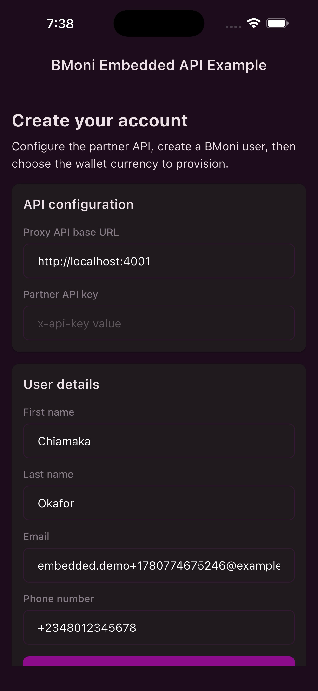
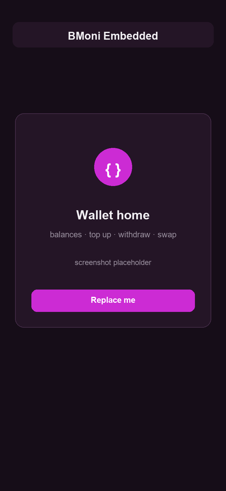
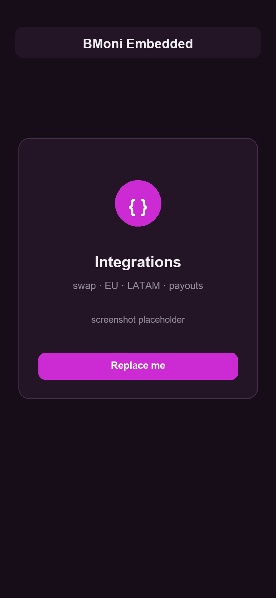

<div align="center">

# 🪙 BMoni Embedded — Flutter Example

**A reference Flutter client for the BMoni Embedded Proxy API.**

Create a user, provision a managed smart wallet, complete KYC, move money across
fiat & crypto rails, and exercise every regional ramp — with the on-device
[`bmoni_embedded_sdk`](https://pub.dev/packages/bmoni_embedded_sdk) handling keys
and signing.

<br/>


</div>

---

## 📸 Screenshots

<table>
  <tr>
    <td align="center" width="33%">
      <br/>
      <sub><b>Configure & create</b></sub>
    </td>
    <td align="center" width="33%">
      <br/>
      <sub><b>Wallet home</b></sub>
    </td>
    <td align="center" width="33%">
      <br/>
      <sub><b>Integrations</b></sub>
    </td>
  </tr>
</table>

> `02` and `03` are placeholders — drop real captures into `docs/screenshots/`
> (same file names) to replace them.

---

## ✨ What it shows

A single guided flow, end to end:

| Step | API |
| :--- | :--- |
| 👤 Create a user | `POST /v1/users` |
| 💳 Provision a managed smart wallet | `owner-proof-challenges` → sign EIP-191 → `create-managed` |
| 🪪 Complete KYC | options · occupations · ID + PoA + biometric uploads · `readiness` · `activate` |
| 🚦 Activate the rail | `start-usa` / `start-canada` / `start-monerium` / `start-nigeria` / `latam/mx/kyc/activate` |
| 💰 Top up | crypto (`deposit/supported-assets` → `deposit/wallet`) or bank rail (USD VBA via `start-usa`; NGN / EUR VBA routed via `smart-wallets/:id/onramp/vba/{nigeria,eu}`; MXN CLABE via `deposit-accounts/MXN`) |
| 🏦 Withdraw | Nigeria bank offramp → proposal → sign with the owner key |
| 🔁 Swap | `exchange/convert` rate preview |
| 🧩 Integrations | the regional/provider ramps (below) |

Currencies: **USD** (`USDB`), **CAD** (`CADC`), **EUR** (`EURe`), **NGN** (`CNGN`),
**MXN** (`MEXe`). The picker is filtered by
`GET /v1/smart-wallets/supported-currencies`, so it follows the API rather than a
hardcoded list.

> [!NOTE]
> **This is a demo, not production.** It favours clarity over polish — one
> `lib/main.dart`, raw JSON response panels, minimal state. Use it as a contract
> reference for your own integration.

---

## 📂 What's inside

```text
lib/main.dart        # the entire example — UI + ProxyApiClient + models
docs/screenshots/    # images used in this README
```

`lib/main.dart` is intentionally one file, in three parts:

| Part | Role |
| :--- | :--- |
| **`ProxyApiClient`** | A thin, typed HTTP client over every proxy endpoint — the single source of truth for request/response shapes. |
| **`_ExampleHomePageState`** | The guided flow: config → create account → currency → smart wallet → wallet home → KYC wizard. |
| **Models & widgets** | `SmartWallet`, `ProxyUser`, and small reusable widgets (`_SectionCard`, `_TextInput`, `_LastResponsePanel`, …). |

---

## 🧩 Integrations screen

Open **Explore integrations** from the wallet home. One section per provider —
each calls the proxy and dumps the raw response. Flows that return a
`signatureRequest` expose a **Sign & submit** button that signs `hashToSign`
with `BmoniEmbeddedSdk.signTransactionHash(...)` and completes via the matching
endpoint.

| Integration | Endpoints |
| :--- | :--- |
| 🔁 **Swap quote** | `GET exchange/rate/:from/:to` · `POST exchange/quote` |
| 🇪🇺 **EU SEPA / Monerium** | `POST eu/kyc` · `eu/orders/prepare` · `eu/orders/complete` · `eu/files` |
| 💵 **LATAM cash** (Pago46) | `POST latam/cash/orders/{fund,send}` · `GET latam/cash/orders[/:id]` · `POST latam/cash/payouts/foreign` (USD → MXN / CLP / COP bank payout) |
| 🇲🇽 **LATAM Mexico** (Etherfuse) | `latam/mx/kyc/{activate,status,launch/agreements}` · `POST onboarding/start-mexico` · `POST latam/mx/quote` (offramp) · `GET latam/mx/orders/:id` · `latam/mx/mxne-migration/{status,prepare}` |
| 🇺🇸 **USD virtual bank account** | `GET kyc/usd-readiness` · `POST onboarding/start-usa` or `POST smart-wallets/:id/onramp/vba/usd/provision` · `GET vba/usd` |
| 🏧 **Bank payouts** (Fin) | `GET payouts/{countries,banks,bank-branches}` · `POST payouts/validate-account` · `POST payouts` |

Signatures complete via `POST wallets/submit-signature` (or `eu/orders/complete`
for EU orders), then settle via `GET wallets/workflows/:workflowId`: poll until
`isTerminal`. It is the only settlement signal for the MXN offramp, the MXNe
migration and LATAM payouts.

---

## 🚀 Run

**1. Run the example:**

```bash
flutter pub get
flutter run
```

**2. In the app**, set the proxy base URL and your partner `x-api-key`, then
create an account.

> Use the server **origin only** (e.g. `http://localhost:4001`) — **without** a
> trailing `/v1`. Paths already start with `/v1/`. Default base URL is
> `http://10.0.2.2:4001` on Android emulators, `http://localhost:4001`
> elsewhere.

---

## 🔑 Authentication

Every request sends the partner key as an **`x-api-key`** header. Use the
`bmoniUserId` returned by `POST /v1/users` for all user-scoped endpoints.

---

## 📝 Notes

- **Photos** — declares `NSPhotoLibraryUsageDescription` (iOS) and
  `READ_MEDIA_IMAGES` / `READ_EXTERNAL_STORAGE` (Android, max SDK 32) so gallery
  picks work for KYC document uploads. Add `NSCameraUsageDescription` only if you
  switch to camera capture.
- **`create-managed`** runs prepare + deploy + owner-registration server-side,
  but the client must first prove control of the embedded owner address by
  signing the owner-proof challenge.
- **Global KYC path** — USD, EUR and MXN require a biometric selfie
  (`POST …/kyc/documents/biometric`, file field `selfie`) and liveness
  (`sumsubLevelName: id-and-liveness`) at activation. NGN activates with
  `id-only`; CAD routes to PayTrie and sends no `sumsubLevelName`.
- **MXN** activates through Etherfuse (`POST …/latam/mx/kyc/activate`, no body)
  and reports status from `GET …/latam/mx/kyc/status`, not `onboarding/status`.
  Onramp is deposit-driven: MXN sent by SPEI to the CLABE from
  `GET …/deposit-accounts/MXN` credits the wallet. Offramp runs
  `latam/mx/quote` → sign → `wallets/submit-signature`.
- **Nigerian withdrawal** — the bank list comes from
  `GET …/bank-accounts/nigerian-banks`, and registration requires the exact
  holder name returned by `verify-nigerian-account`, so **Verify** gates
  **Save payout & offramp**. The offramp returns a *proposal*: once approvals
  move it to `PENDING_SIGNATURES`, the wallet-home card signs
  `…/proposals/:id/sign-payload` with `signTransactionHash` and submits it to
  `…/proposals/:id/sign`.
- **Sandbox BVN** — the NGN step is prefilled with the docs' test BVN
  `22222222222`.
- **Session** state is stored with `shared_preferences`, so logout returns to the
  PIN unlock screen without recreating the account.
- **Native signer** — Android debug builds need the native
  `me.bkey.ip:bmonisigner` dependency (used by `bmoni_embedded_sdk`) available
  from a configured Maven repository.

---

## 📦 Related packages

| Package | Purpose |
| :--- | :--- |
| [`bmoni_embedded_sdk`](https://pub.dev/packages/bmoni_embedded_sdk) | On-device EVM wallet + signing primitives |
| [`bmoni_embedded_wallets_cards`](https://pub.dev/packages/bmoni_embedded_wallets_cards) | Wallet card UI |
| [`bkey_uikit`](https://pub.dev/packages/bkey_uikit) | Shared UI components |
